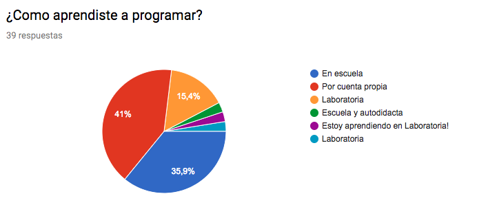
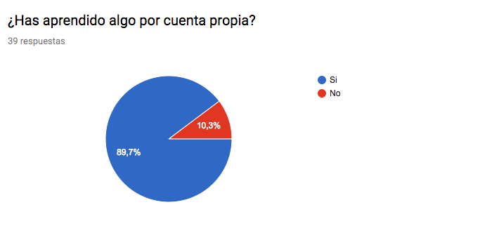
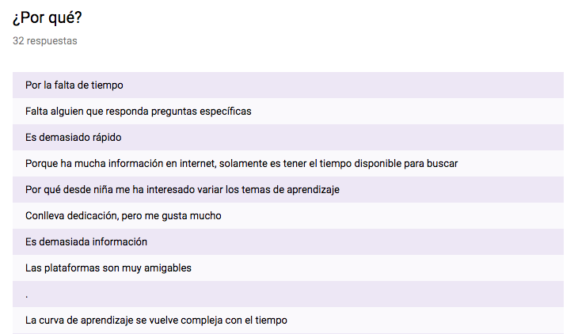
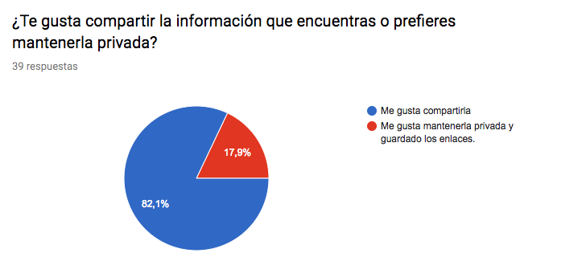
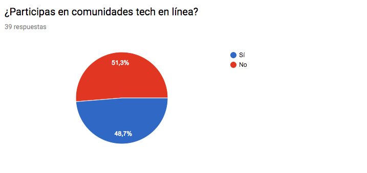
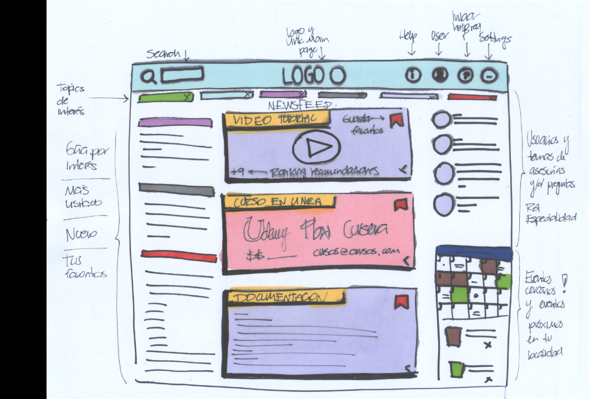
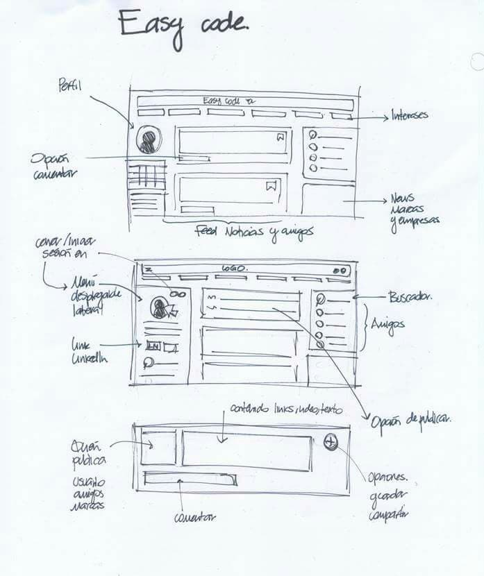
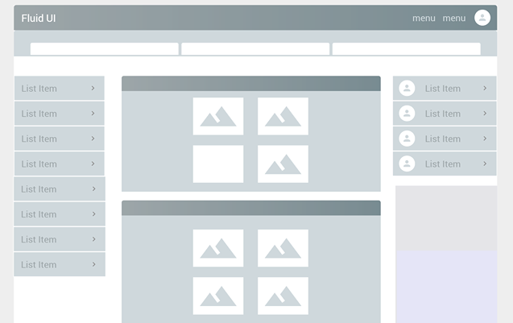

# Easy Code

## DESCUBRIMIENTO

**LLUVIA DE IDEAS**

Se identificó un problema, el que las personas que quieren aprender a programar, que lo hacen por cuenta propia o simplemente alguien que ya tiene conocimientos pero busca información en internet, al momento de buscar datos específicos que necesitan se encuentran con mucha información en la red, de diferentes tipos. Se indago sobre las posibles causas que pueden generar la necesidad de esta red social para personas que aprenden por sí mismos y se mencionaron las siguientes: hay mucha información por lo que se pierde tiempo buscando en diferentes páginas, todos los recursos están dispersos en la red en diferentes plataformas, es complicado encontrar a otras personas con sus mismos intereses, si se encuentran personas es difícil hacer el primer contacto.

**ENCUESTAS**

Se realizaron encuestas a personas con el perfil que se señala en este documento, personas de edad no especificada que estén aprendiendo a programar por cuenta propia, que aprendan temas de manera autónoma. La encuesta cuenta con la siguiente estructura:

**¿Cuánto tiempo llevas programando?**

* 0-6 Meses
* 6-12 Meses
* 1-3 Años
* +3 Años

**¿Cómo aprendiste a programar?**

* En escuela
* Por cuenta propia
* Otra _____

**¿Has aprendido algo por cuenta propia?**

* Si
* No

**¿Qué has aprendido?**

* (Respuesta abierta) _______

**¿Ha sido fácil el proceso de aprender estos temas?**

* Sí
* No

**¿Por qué?**

* (Respuesta abierta) _______

**¿En dónde buscas información para aprender temas nuevos?**

* YouTube
* Google
* Páginas web sobre programación
* Stack Overflow
* Cursos ( Platzi, Udemy, Coursera, etc)
* Otra _____

**De los lugares que visitas ¿Cuál te ha sido más útil? ¿Por qué?**

* (Respuesta abierta) _______

**¿Qué temas buscas?**

* Front-end
* Back-end
* Bases de datos
* Programación en general

**¿Te gusta compartir la información que encuentras o prefieres mantenerla privada?**

* Me gusta compartirla
* Me gusta mantenerla privada y guardado los enlaces.

**¿Participas en comunidades tech en línea?**

* Sí
* No

## DEFINICIÓN

**HIPÓTESIS**

La cantidad de información de las diferentes plataformas está dispersa, hay muchos recursos en diferentes sitios y se pierde tiempo navegando de un lado a otro. No es fácil encontrar personas con tu mismo perfil y si las encuentras es difícil hacer el primer contacto.

**OBJETIVO PRINCIPAL**

Crear una plataforma en la cuál sea fácil conectar personas con intereses sobre programación y que estas puedan tener acceso a toda la información relevante de manera más accesible.

**PROBLEMA PRINCIPAL**

Con la investigación se tomaron como referencia encuestas a individuos con un perfil afín al de va dirigido este proyecto, personas que aprenden por su propia cuenta sobre programación. Los principales problemas se resumen en los siguientes puntos:

* Hay mucha información en internet y se necesita mucho tiempo para buscar.

* La curva de aprendizaje se vuelve compleja con el tiempo.

* Es difícil encontrar información útil.

* Se necesita apoyo de otra persona que pueda resolver alguna duda.

* Información está en otro idioma.

**PRUEBAS Y RESULTADOS - LLUVIA DE IDEAS**

Se recibieron respuestas de 39 personas con la encuesta que se realizó, se analiza la lluvia de ideas inicial y se confirman algunos supuestos que se habían establecido en el inicio. Se observa enseguida la información más relevante:

***

Del total de los encuestados 41% aprendió a programar por cuenta propia, lo que nos indica que actualmente es cada vez más común que las personas inicien y aprendan de manera autodidacta.

***

De este total de encuestados el 89.7% declaró haber aprendido algo por cuenta propia, lo que confirma que no importa si una persona aprendió programación en la universidad o por otro medio, en esta área siempre se está aprendiendo y no es necesario estar en un salón de clases para poder hacerlo.

***

El 52.6% de los encuestados declaró que el proceso de aprendizaje por cuenta propia ha sido difícil, en la siguiente gráfica se enlistan las razones principales.

***

Las respuestas más comunes del por qué es difícil aprender por cuenta propia señalan algunos supuestos que se establecieron en la lluvia de ideas inicial, por que hay demasiada información, no hay tiempo suficiente para revisar toda esa información y se agregan algunos problemas como la falta de alguna persona que resuelva dudas específicas.

***

En este apartado se observa el comportamiento de las personas en cuanto compartir la información, notando que es algo que les gusta hacer.

***

Finalmente observamos que más del 50% de las personas participan en comunidades en línea lo que muestra un claro interés por tener interacción con otras personas con intereses similares a los suyos.

***

Es así como podemos confirmar la necesidad de una red social, en la cual se pueda contar con la información más importante proveniente de diferentes plataformas específica de esta área, recursos útiles, un lugar en el que la interacción entre personas que están aprendiendo a programar o temas de programación sea más fácil y que se pueda compartir la información.

## PROTOTIPADO

**SKETCH**

**MOCK UP**

